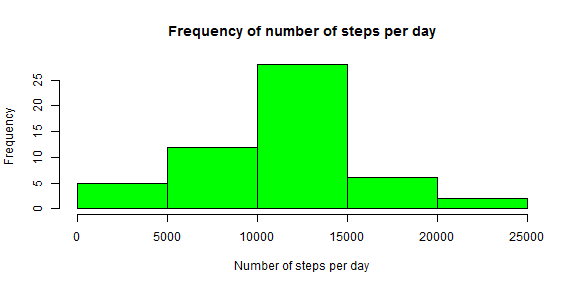
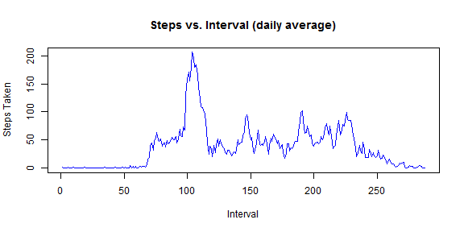
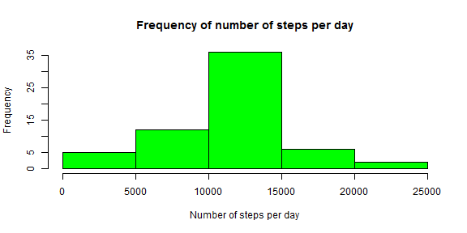
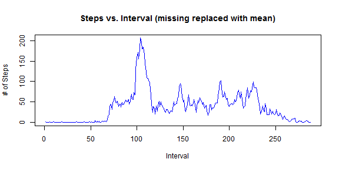
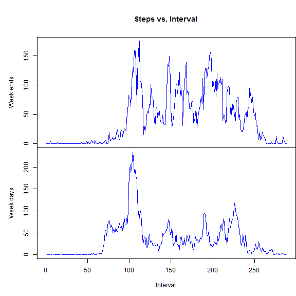

# Reproducible Research: Peer Assessment 1


## Loading and preprocessing the data

```r
setwd("C:/Users/Pete/Personal/Coursera/Reproduceable Research/Project1")
data <- read.csv("activity.csv")
```

## What is mean total number of steps taken per day?

1. Make a histogram of the total number of steps taken each day
2. Calculate and report the **mean** and **median** total number of steps taken per day


```r
stepsTotalPerDay <- tapply(data$steps, data$date, sum)
hist(stepsTotalPerDay, breaks = 6, main = "Frequency of number of steps per day", 
    xlab = "Number of steps per day", ylab = "Frequency", col = "green")
```

 

**Mean** steps per day

```r
stepsMeanPerDay <- tapply(data$steps, data$date, mean, na.rm = T)
mean(stepsTotalPerDay, na.rm = T)
```

```
## [1] 10766
```

**Median** steps per day

```r
median(stepsTotalPerDay, na.rm = T)
```

```
## [1] 10765
```

## What is the average daily activity pattern?

1. Make a time series plot (i.e. type = "l") of the 5-minute interval (x-axis) and the average number of steps taken, averaged across all days (y-axis)
2. Which 5-minute interval, on average across all the days in the dataset, contains the maximum number of steps?

```r
stepsMeanPerInterval <- tapply(data$steps, data$interval, mean, na.rm = T)
plot(stepsMeanPerInterval, type = "l", main = ("Steps vs. Interval (daily average)"), 
    ylab = "Steps Taken", xlab = "Interval", col = "blue")
```

 

Interval with the maximum number of steps:

```r
seq(along = stepsMeanPerInterval)[stepsMeanPerInterval == max(stepsMeanPerInterval)]
```

```
## [1] 104
```

## Imputing missing values

1. Calculate and report the total number of missing values in the dataset (i.e. the total number of rows with NAs)
2. Devise a strategy for filling in all of the missing values in the dataset. The strategy does not need to be sophisticated. For example, you could use the mean/median for that day, or the mean for that 5-minute
3. Create a new dataset that is equal to the original dataset but with the missing data filled in.
4. Make a histogram of the total number of steps taken each day and Calculate and report the mean and median total number of steps taken per day. Do these values differ from the estimates from the first part of the assignment? What is the impact of imputing missing data on the estimates of the total daily number of steps?

Number of **missing** data:

```r
sum(as.numeric(is.na(data$steps)))
```

```
## [1] 2304
```


```r
# Get the steps mean per interval as a vector
tmp_stepsMeanPerInterval <- as.vector(stepsMeanPerInterval)
# Repeat it to be the same for each of the 61 days
tmp_stepsMeanPerInterval <- rep(tmp_stepsMeanPerInterval, 61)
# Set it one where there is no missin data
tmp_stepsMeanPerInterval[!is.na(data$steps)] = 1

# Get the steps data as a vector
tmp_dataTest <- as.vector(data$steps)
# Set it to one where data is missing
tmp_dataTest[is.na(tmp_dataTest)] = 1

data_NoMissing <- data
data_NoMissing$steps <- tmp_stepsMeanPerInterval * tmp_dataTest


# stepsMeanPerDay_NoMissing <-
# tapply(data_NoMissing$steps,data_NoMissing$date,mean,na.rm=T)
# stepsMedianPerDay_NoMissing <-
# tapply(data_NoMissing$steps,data_NoMissing$date,median,na.rm=T)

stepsTotalPerDay_NoMissing <- tapply(data_NoMissing$steps, data_NoMissing$date, 
    sum)
hist(stepsTotalPerDay_NoMissing, breaks = 6, main = "Frequency of number of steps per day", 
    xlab = "Number of steps per day", ylab = "Frequency", col = "green")
```

 

Mean total number of steps taken per day (**missing replaced by mean** for that interval):

```r
stepsMeanPerInterval_NoMissing <- tapply(data_NoMissing$steps, data_NoMissing$interval, 
    mean)
mean(stepsTotalPerDay_NoMissing)
```

```
## [1] 10766
```

Median total number of steps taken per day (**missing replaced by mean** for that interval):

```r
median(stepsTotalPerDay_NoMissing)
```

```
## [1] 10766
```

Time series with **missing data replaced with mean**

```r
plot(stepsMeanPerInterval_NoMissing, type = "l", xlab = "Interval", ylab = "# of Steps", 
    main = "Steps vs. Interval (missing replaced with mean)",col = "blue")
```

 

## Are there differences in activity patterns between weekdays and weekends?

1. Create a new factor variable in the dataset with two levels - "weekday" and "weekend" indicating whether a given date is a weekday or weekend day.
2. Make a panel plot containing a time series plot (i.e. type = "l") of the 5-minute interval (x-axis) and the average number of steps taken, averaged across all weekday days or weekend days (y-axis).

```r
# Create a factor variable with two levels (weekday, weekend-day)
tmpLT <- as.POSIXlt(data$date, format = "%Y-%m-%d")
tmpWeekDays <- tmpLT$wday
tmpWeekDays[tmpWeekDays == 0] = 0
tmpWeekDays[tmpWeekDays == 6] = 0
tmpWeekDays[tmpWeekDays != 0] = 1
tmpWeekDaysFactor <- factor(tmpWeekDays, levels = c(0, 1))
# Add the factor variable to the data
data$WD <- tmpWeekDaysFactor
# Calculate the mean
stepsMeanPerWeekday <- tapply(data$steps, list(data$interval, data$WD), mean, 
    na.rm = T)

par(mfrow = c(2, 1))
# Display the 2 plots
with(data, {
    par(mai = c(0, 1, 1, 0))
    plot(stepsMeanPerWeekday[, 1], type = "l", main = ("Steps vs. Interval"), 
        xaxt = "n", ylab = "Week ends",  col = "blue")
    title = ("# of Steps v.s. Interval")
    par(mai = c(1, 1, 0, 0))
    plot(stepsMeanPerWeekday[, 2], type = "l", xlab = "Interval", ylab = "Week days",  col = "blue")

})
```

 
